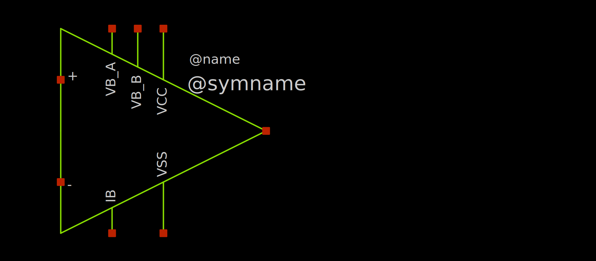
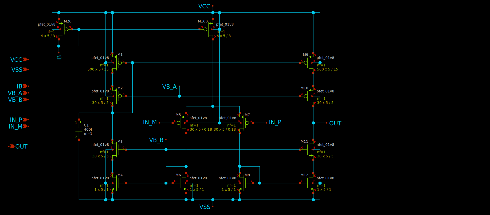
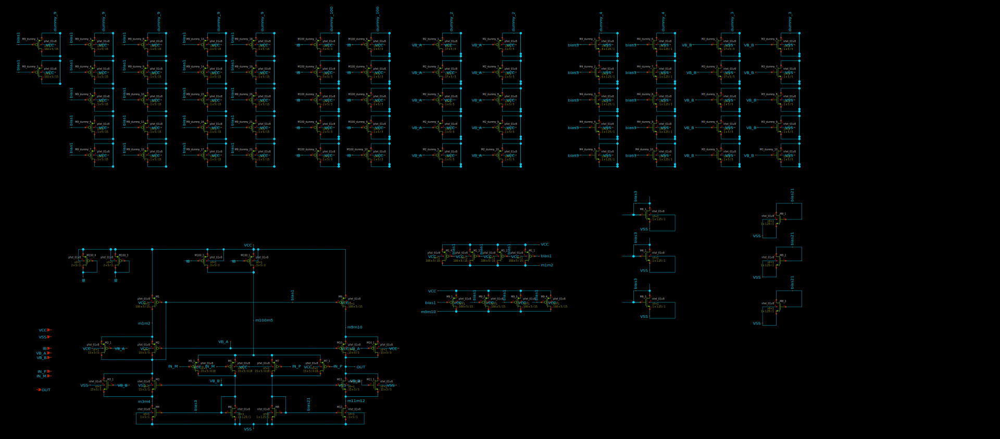

# SKY130_OpAmp
Folded Cascode Operational Amplifier for Skywater 130nm

# Repo structure
- 01_IdeaDesign -> Idea first sketch / schematic + symbol
- 02_IdeaSim -> Simulation directory for Idea schematic (links to 01_IdeaDesign and 0X_SimDefs)
- 03_Layout -> Modified schematic for layout (added dummy devices) and all files produced by Magic during layout
- 04_LayoutSim -> Simulation directory for Layout schematic (links to 03_Layout and 0x_SimDefs), without RC parasitics but with dummies included
- 05_LVS -> Layout Vs Schematic check
- 06_ParasiticsSim -> Simulation directory for post Layout / extracted device with RC parasitics
- 09_Results -> GDS, LEF, SPICE netlist (for final LVS check), Verilog stub, all to be integrated as a part of bigger design / submission
- 0X_SimDefs -> General directory with all simulation benches to be reused in different phases (currently only used in 02_IdeaSim to simulate 01_IdeaDesign and 04_LayoutSim to simulate 03_Layout)

# What's needed to play with it
- Xschem
- Magic
- Ngspice
- Netgen

# How to start
- run xschem in main directory, open schematics or simulations from subdirectories

# Additional OpAmp IOs (for future adjustment)
- IB -> bias current for input differential pair
- VB_A, VB_B -> bias voltages for cascodes 

# Symbol

# Idea schematics (starting point)

# Layout schematics (with so many dummy transistors added...)

